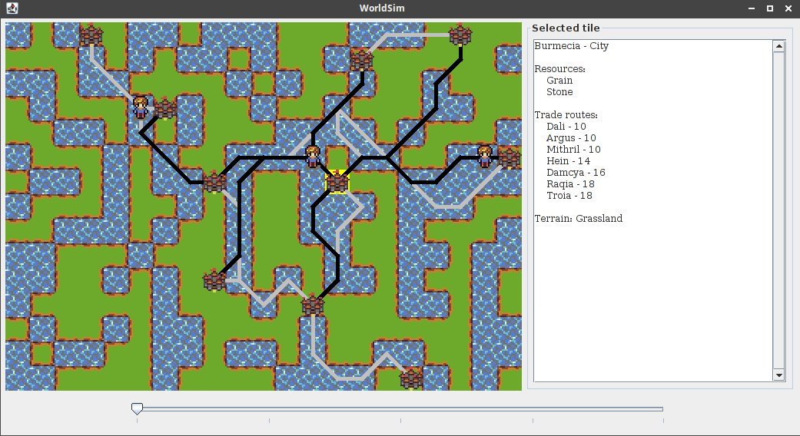

WorldSim
========

A small world generator and trading simulator written in Java.

I made this as a side project to learn Java. Wanted to do more with it but don't really feel like continuing now. Decided I should release it on Github to at least have it done in some way.

Some fun stuff it does:

 * Uses Poisson Disk Sampling library from [Herman Tulleken's tutorial](http://code-spot.co.za/2010/04/07/poisson-disk-sampling-example-code/) to place cities around the map (his code is included in the WorldSim/src/za directory)
 * Uses Dijkstra's Algorithm with a maximum path distance to create trade routes between cities, see [TradeNode.java](WorldSim/src/worldSim/TradeNode.java) for this
 * All cities have their own resources, and traders go around the map between cities

Controls:

 * Click a tile to select it and get information about the terrain and the city if present
 * You can also move the map cursor with the arrow keys
 * R will create a new world map
 * Space makes time go forward one step, press repeatedly or keep it pressed to see traders moving around the map

---

Some notes on the source code:

 * GUI controls the main program, while WorldModel contains all world information
 * WorldMap and TileInfoText handle parts of the GUI for the visible map and the textual information, respectively
 * It is really at the point where some abstraction should be added. An interface Renderable that should be implemented by City and Trader for drawing code in WorldMap, and an interface Describable that should be implemented by them for TileInfoText would make it so WorldMap and TileInfoText wouldn't have to be edited anymore when adding new stuff to the world
 * I believe you shouldn't live with warnings, but Eclipse had one really annoying one where whenever I had a class that inherited from something that was serializable, it shouted at me to give it a serial version UID, even though I never serialize in this code. I took its suggestion to add some random serialVersionUID strings but I'm not really happy with that.

Some ideas for extending it:

 * Replace the generic dude image for traders with carts, horses and ships facing the correct directions, like with [16x16 fantasy pixel art vehicles](http://opengameart.org/content/16x16-fantasy-pixel-art-vehicles)
 * Use a timer to animate stuff like ships and water, like in the overworld in Super Mario Bros. 3
 * Make time go forward automatically, with the ability to pause
 * Show trader information when they're within the cursor
 * Better map generation (currently it's just a chance of being a water or a grass tile). Maybe using cellular automata to create islands or some height generation algorithm
 * Have traders actually trade resources between cities
 * Have cities use their resources to build stuff
 * Bandits or monsters roaming the map attacking traders
 * Armies or adventurer bands fighting bandits, or taking over other towns to get tribute
 * Ways to influence the world while it's running
 * Make the slider in the bottom move time forward or backwards (save previous state to go back in time)

---

License: [GPLv3](GPLv3.txt)

Stuff used that's made by others, obviously not under the same license:

 * [Tulleken's Poisson Disk Sampling code](http://code-spot.co.za/2010/04/07/poisson-disk-sampling-example-code/)
 * [Tiny 16: Basic tileset](http://opengameart.org/content/tiny-16-basic) by Lanea Zimmerman (See also [WorldMap.java](WorldSim/src/worldSim/WorldMap.java) for full credits and license)
